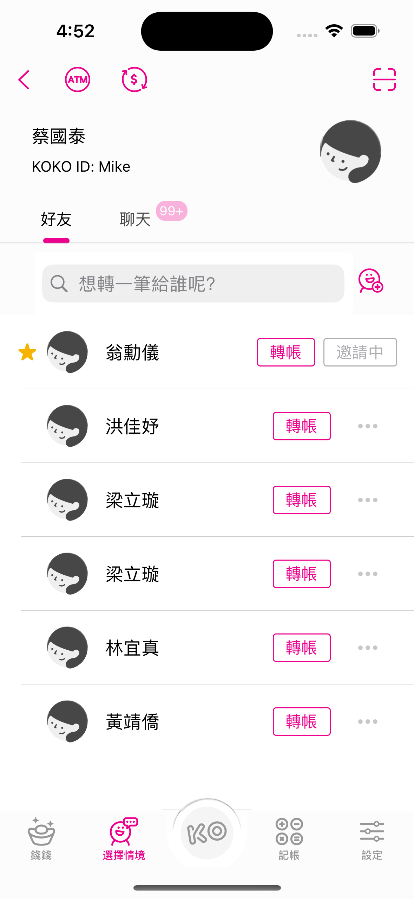
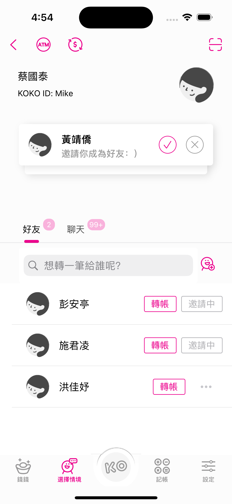
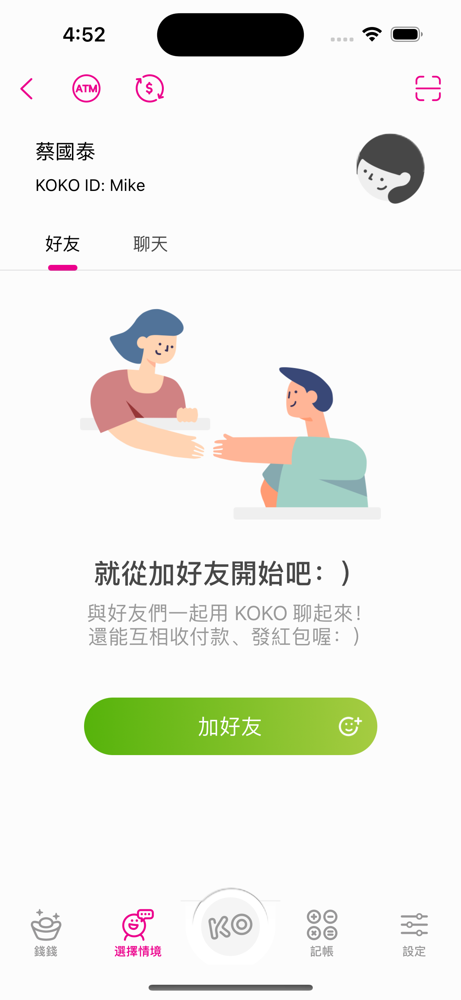
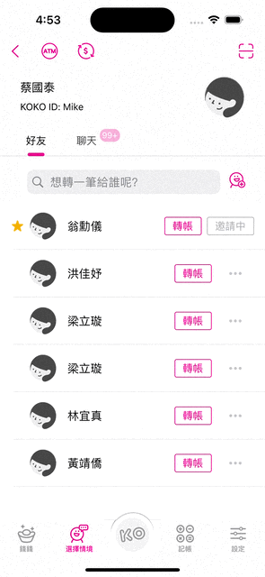
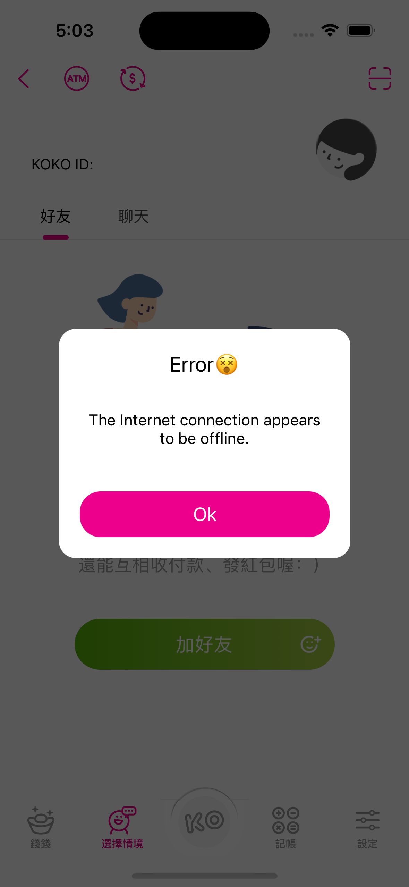

# FriendList
此為一騰資訊服務股份有限公司 IOS APP工程師 作業, fully built in UIKit. 

# Menu
* [Screenshots](#screenshots)
* [Tech](#Tech)
* [Source](#source)
* [Contact](#contact)

# Screenshots

  

* Search

* Custum Alert View

# Tech

* Custum alert
* Async network call
* Custom search bar
* No third party libraries
* Pull to refresh

# Source

### Library

No third party library.

# Contact
Created by [Terry Kuo](https://bento.me/terrykuo) - feel free to contact me!

